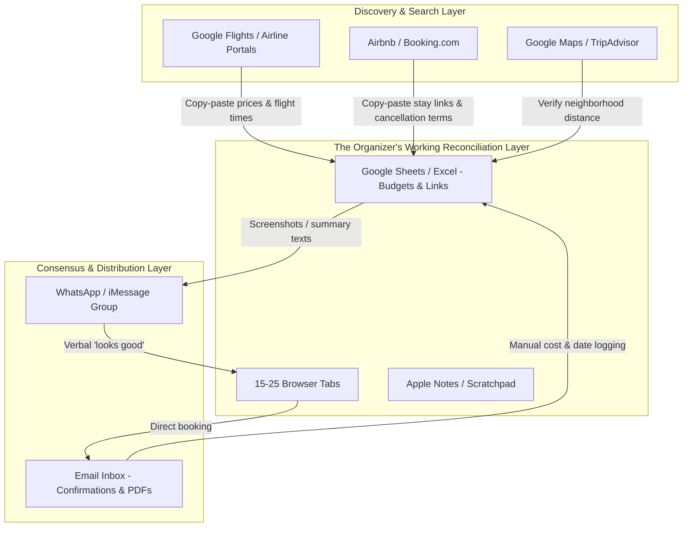

# PHASE 1 — AREA & CONTEXT UNDERSTANDING

## 1. PURPOSE
Before deciding what was broken, I needed to understand how the workflow actually runs today. This phase mapped the system as it exists — actors, tools, handoffs, and the step-by-step sequence from destination-locked to bookings-confirmed — without jumping to solutions.

## 2. CORE QUESTION
How does the lead organizer actually plan, coordinate, book, and reconcile trip logistics today from the moment dates are set until bookings are locked?

## 3. INPUT
- Phase 0 Intake Brief ([00 - Start Here.md](00%20-%20Start%20Here.md)).
- Observational notes on travel booking habits and competitor teardowns (TripIt, Wanderlog, Google Sheets).

## 4. WORK
- Map all key human and institutional actors.
- Map the software tools, systems, and artifacts currently utilized.
- Document the step-by-step chronological baseline workflow.
- Map the information flow across tools and handoffs.

![[Pasted image 20261001143838.png|700]]
---

### Actor & Incentive Map

| Actor | Role in System | Core Objective / Incentive | Downside Risk / Fear |
| :--- | :--- | :--- | :--- |
| **Lead Organizer (Primary)** | Does 90% of search, comparison, booking, and tallying. | Minimize logistical failure; deliver a great trip without blowing budget or being blamed. | Double-bookings, booking non-refundable mistakes, blowing personal credit limit. |
| **Co-Traveler / Group** | Passive consumers / approvers. | Have fun; minimize personal cost and effort; avoid administrative friction. | Feeling out of the loop; feeling overcharged or forced into unwanted plans. |
| **Inventory Vendors (Airlines, Hotels, Hosts, Tour Operators)** | Provide accommodation, transit, and activities. | Maximize booking conversion; enforce strict cancellation/payment deadlines. | Cancellations, customer disputes, empty seats/rooms. |
| **Aggregators & OTAs (Google Flights, Airbnb, Booking.com)** | Discovery and price comparison engines. | Keep user on-platform; earn referral commission or take-rate. | User price-checking off-platform or abandoning cart. |

---

### Systems, Tools & Artifact Ecosystem

---

### Step-by-Step Chronological Baseline Workflow

#### Step 1: Constraint & Anchor Setting
- **Trigger:** Destination and rough dates locked.
- **Organizer Action:** Establishes mental boundaries (target budget ceiling, arrival cutoff times, must-have amenities).
- **Artifact:** Blank note or mental model.

#### Step 2: Interdependent Transit & Lodging Search
- **Organizer Action:** Opens 15–25 browser tabs across OTAs, airlines, and Google Maps.
- **Workflow Dynamics:** Cannot book transit without confirming reasonable lodging in that price range; cannot book lodging without knowing exact arrival/departure times and hubs. Constant cross-checking.
- **Artifact:** Messy scratchpad of candidate links, screenshots, and prices.

#### Step 3: Social Buy-in & Option Presentation
- **Organizer Action:** Condenses options into a digestible message or screenshots sent to co-travelers via WhatsApp/iMessage (*"Option A is $180/night closer to downtown; Option B is $130/night but requires a 25-min bus"*).
- **Friction / Dynamics:** Delays waiting for group responses while inventory changes or flight prices increase.

#### Step 4: Transaction & Commitment Execution
- **Organizer Action:** Uses personal payment method to execute individual bookings across separate platforms.
- **Workflow Dynamics:** Multiple distinct checkouts; differing cancellation windows (e.g., flight 24h risk, hotel pay-at-property, Airbnb strict policy).

#### Step 5: Post-Booking Reconciliation & Centralization
- **Organizer Action:** Receives 3–6 different confirmation emails. Manually parses confirmation codes, check-in rules, addresses, and final charges into a single spreadsheet or pinned note.
- **Terminal State:** Master trip summary document created; group notified.

---

## 5. KEY OBSERVATION
The most important thing to recognize at this stage: spreadsheets and notes apps are not broken tools. They're the glue users reach for when point solutions don't talk to each other. The workflow above shows why — each platform (OTA, airline, map) only handles its own transaction. The organizer becomes the integration layer.

## 6. RESEARCH / ANALYSIS METHODS
- Workflow deconstruction of recent personal and peer trips.
- Teardowns of dedicated itinerary tools (TripIt email parsing, Wanderlog manual entry).
- Community review mining (r/travel, r/solotravel, travel planning forums).

## 7. OUTPUTS

- System / Workflow Map (documented above).
- Actor and System Inventory.

## 8. DECISION
**GO (GATE 1 CLEARED)** — The baseline workflow, actor incentives, and tool handoffs are clearly modeled without speculation or solution bias.

## 9. EXIT CRITERIA
Able to explain the complete workflow, systems, and actor handoffs from memory without assuming what product to build.

## 10. FAILURE CONDITIONS
Describing how travel apps *wish* users planned trips (e.g., all-in-one platforms) rather than how users *actually* plan trips (messy tabs, spreadsheets, and chat).

## 11. BACKTRACK CONDITIONS
If research indicates that organizers do not plan or reconcile bookings sequentially, but rather rely entirely on third-party package tour operators.

## 12. AI ROLE
I used AI to format the workflow models and verify the clarity of the actor map.

## 13. HUMAN ROLE
I mapped the baseline workflow based on authentic human behavior and identified the actors and handoffs.

## 14. COMMON FAILURE MODES
Jumping into user pain points before the baseline flow is completely drawn.

## 15. NEXT PHASE
[PHASE 2 — PROBLEM SPACE MAPPING](02%20-%20Map%20the%20Problem%20Space.md)

## 16. STATUS
The baseline flow is completely mapped. Every friction point, breakdown, and manual translation that occurs is ready to be categorized in Phase 2.
