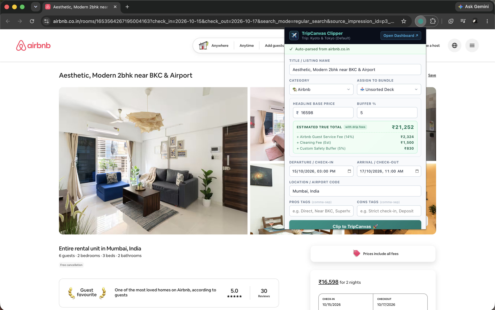
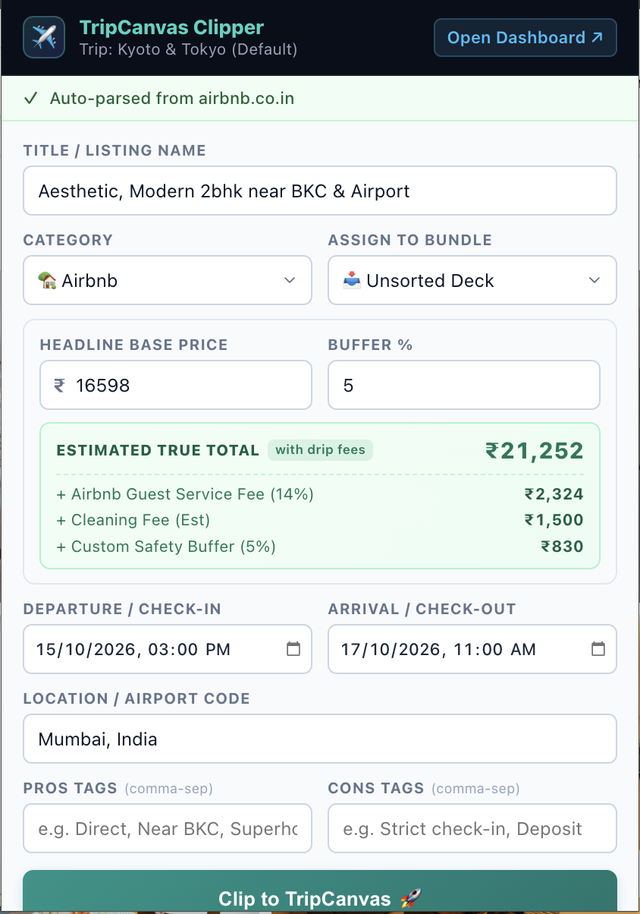

# TripCanvas Extension Clipper

The TripCanvas Extension Clipper is a companion Chrome Extension built for the TripCanvas web application. 

Extracting accurate pricing and schedule data directly from Online Travel Agencies (OTAs) via traditional server-side scraping is heavily restricted by aggressive bot protection (DataDome, PerimeterX, 403 Forbidden checks, etc.). 

This browser extension circumvents those limitations by operating directly within the user's authenticated DOM, easily clipping flights, hotels, and Airbnb listings into the TripCanvas application context.

---

## 📸 Extension Preview

| In-Situ Browser Clipping (Airbnb) | Clipper Popup Detail |
|:---:|:---:|
|  |  |
| *Real-time extraction directly on the OTA listing page* | *Dynamic true-cost preview with hidden fee estimations* |

---

## 🛠 Tech Stack

*   **Platform:** Google Chrome Extension
*   **Architecture:** Manifest V3
*   **Permissions:** `activeTab`, `scripting`, `storage`

## 🏗 Architecture Highlights

### 1. DOM Extraction
The extension injects content scripts directly into OTA domain pages (e.g., Airbnb, Booking.com, airline portals). It reads the currently rendered DOM elements to extract the Option Title, Base Price, Check-In/Check-Out times, and Flight arrival times—without triggering automated server-side blocks.

### 2. State Syncing
Once a user clicks the "Clip to TripCanvas" action, the extension passes the structured JSON payload back to the TripCanvas Web Application via `localStorage` or `window.postMessage`, instantly adding the new option to the user's Unsorted Deck.

## 🚀 Installation Setup (Development)

To load the extension locally into Chrome:

1. Open Google Chrome and navigate to `chrome://extensions/`.
2. Enable **Developer mode** (toggle switch in the top right corner).
3. Click the **Load unpacked** button.
4. Select this `extension/` directory.

The TripCanvas Clipper icon will now appear in your browser toolbar, ready for testing on supported domains.
